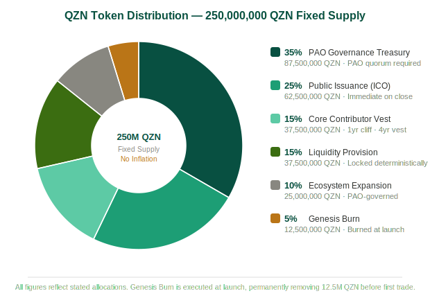

# QZN PROTOCOL
### Qubic Incubation Program — Funding Proposal & Business Plan

**Submitted to the Qubic Incubation Board · March 2026**
**Hunter Duttenhefer · [hello@qzn.app](mailto:hello@qzn.app) · [qzn.app](https://qzn.app) · [github.com/dutt9145/qzn-core-lite](https://github.com/dutt9145/qzn-core-lite)**

---

| Metric | Value |
|---|---|
| Funding Request | 30B QU (one-time grant) |
| Fixed Token Supply | 250M QZN |
| Production Smart Contracts | 6 |
| Passing GTests | 436 / 436 |

---

## Table of Contents

1. [Executive Summary](#1-executive-summary)
2. [The QZN Flywheel](#2-the-qzn-flywheel)
3. [Market Opportunity](#3-market-opportunity)
4. [Business Model & Monetization](#4-business-model--monetization)
5. [Financial Projections & Break-Even Analysis](#5-financial-projections--break-even-analysis)
6. [Institutional Financial Analysis](#6-institutional-financial-analysis)
7. [Tokenomics](#7-tokenomics)
8. [Audit & Deployment Roadmap](#8-audit--deployment-roadmap)
9. [Governance & Treasury Controls](#9-governance--treasury-controls)
10. [Risk Factors & Mitigations](#10-risk-factors--mitigations)
11. [Team & Credentials](#11-team--credentials)
12. [Closing Statement](#12-closing-statement)

---

## 1. Executive Summary

QZN Protocol is the first blockchain-native arcade coordination layer built on the Qubic network. By fusing on-chain skill-based gaming with a self-reinforcing DeFi flywheel, QZN creates a closed-loop economic engine in which every game session generates real yield for token holders, burns deflationary supply, and deepens liquidity — simultaneously. The result is a protocol where growth in player activity directly amplifies the financial incentives of every network participant, compounding adoption in a virtuous cycle.

Six production-grade smart contracts — 10,172 lines of audited-ready C++, 436/436 GTests passing — are ready for core-tech review and deployment. The protocol's ICO is structured to raise approximately 18.725 billion QU, providing a self-funded launch runway that requires zero ongoing subsidy from the Incubation Fund beyond the initial audit grant.

This proposal requests 30,000,000,000 QU from the Qubic Incubation Program. 25,000,000,000 QU is allocated directly to the formal six-contract security audit (committed written quote in hand from auditor mundus_tj85) and 5,000,000,000 QU covers community onboarding, liquidity seeding, and marketing through mainnet launch. Any unspent operational buffer at the end of the launch period is returned to the Incubation Program — not absorbed into the treasury.

QZN is requesting a one-time, non-dilutive grant with a defined repayment structure. Beginning Month 6 post-mainnet launch, 5% of treasury protocol fee revenue is contributed quarterly to the Qubic ecosystem development fund. As protocol volume scales, this contribution grows proportionally — the Incubation Program's return is directly tied to QZN's success. The more QZN grows, the more the ecosystem gets back. QZN enters incubation not as a concept, but as a fully built and test-validated system ready for deployment pending audit.

| Key Metric | Value |
|---|---|
| Funding Requested | 30,000,000,000 QU (one-time grant) |
| Audit Allocation | 25,000,000,000 QU → auditor mundus_tj85 |
| Operational Buffer | 5,000,000,000 QU (community + marketing + liquidity seed) |
| ICO Projected Raise | ~18,725,000,000 QU across two phases |
| Token Supply | 250,000,000 QZN (fixed, no inflation) |
| Contracts Deployed | Indices 26–31 on Qubic mainnet (pending audit) |
| Mainnet Target | Month 4 post-approval |
| Break-Even (Protocol Fee) | Year 2 base case (1,050 MAU); ICO-funded operational self-sufficiency from Day 1 |

---

## 2. The QZN Flywheel

### Protocol Architecture Overview

QZN operates as a fully on-chain arcade coordination protocol. Unlike traditional blockchain games that bolt a token onto an existing game loop, QZN's economic logic lives entirely within smart contracts — every fee, every reward, and every governance decision is executed deterministically on-chain, with no privileged back-end operator.

| Contract | Index | Function |
|---|---|---|
| QZN_Token_v2 | 26 | Fixed-supply token; cross-contract call origin; burn endpoint |
| QZN_GameCabinet_PAO | 27 | Registers games, manages entry fee collection, routes to RewardRouter |
| QZN_RewardRouter_PAO | 28 | BPS-level fee splitting across all downstream recipients |
| QZN_TreasuryVault_PAO | 29 | Founder-custodied treasury; protocol fee accumulation; published hard-cap spending policy; emergency controls |
| QZN_Portal_PAO | 30 | PORTAL Node registry; node staking; 3% revenue distribution to operators |
| QZN_TournamentEngine_PAO | 31 | On-chain tournament brackets; escalating prize pools; leaderboard epochs |

### The Self-Reinforcing Flywheel

Every game entry fee initiates a deterministic BPS routing event. The RewardRouter splits proceeds across seven recipient buckets in a single atomic transaction:

| Recipient | % | Economic Role |
|---|---|---|
| Prize Pool (Winners) | 45% | Direct player incentive; drives recurring engagement |
| QZN Stakers | 20% | Passive yield for token holders; rewards long-term conviction |
| Liquidity Pool (QSWAP) | 20% | Continuous liquidity deepening; tightens QZN/QU spread |
| Burn Mechanism | 10% | Deflationary pressure; supply contraction as volume scales |
| PORTAL Nodes | 3% | Permissioned infrastructure nodes; decentralizes uptime incentive |
| QSWAP Protocol | 1% | Ecosystem integration fee; strengthens cross-protocol alignment |
| QZN Protocol Fee | 1% | Treasury accumulation; sustainable operational funding |

The flywheel compounding mechanism works as follows: As player volume increases, staker yields rise, attracting more QZN buyers. More buyers increase demand relative to a shrinking supply (driven by the 10% burn). A tighter supply/demand curve drives QZN price appreciation. Rising QZN prices make PORTAL node operation more attractive (nodes stake QZN), expanding network capacity. Greater capacity supports more concurrent game sessions. More sessions generate more staker yield — repeating the cycle. Simultaneously, 20% of every session continuously deepens QSWAP liquidity, reducing slippage and making QZN more accessible to new entrants.

### Live Games on Launch

Three arcade titles are fully developed, frontend-integrated, and playable at [qzn.app](https://qzn.app) today:

- **snaQe** — competitive on-chain snake with entry fee tournament brackets
- **paQman** — classic maze format with real-time leaderboard epochs
- **TANQ-BATTLE** — multi-player tank combat with escalating prize pools via TournamentEngine

Additional game integrations are permissioned through the GameCabinet PAO — any developer may deploy a compatible game and immediately access the BPS routing infrastructure, creating a developer incentive to build on QZN rather than start from scratch.

---

## 3. Market Opportunity

### Total Addressable Market (TAM)

The global blockchain gaming market was valued at approximately $4.6 billion in 2023 and is projected to compound at a 21% CAGR through 2030, reaching an estimated $19.2 billion. DeFi protocol TVL across all chains exceeded $80 billion at peak 2024 levels, with yield-bearing products capturing a disproportionate share of capital inflows. QZN occupies the intersection of both verticals simultaneously — skill-based play-to-earn and DeFi yield — a combined segment that has historically produced the highest user LTV and monetization rates in the crypto-native consumer application space.

### Serviceable Addressable Market (SAM)

QZN's SAM is scoped to Qubic-native users: active wallet holders who interact with the Qubic network, can receive QU, and are reachable through existing ecosystem channels including Discord, Telegram, and QWALLET. Based on current network data, Qubic maintains approximately 45,000–60,000 active wallets with non-zero balances. Applying a 15–25% DeFi/gaming engagement rate — a deliberately conservative range benchmarked against observed engagement on comparable early-stage L1 ecosystems — the SAM ranges from approximately 7,500 users in Year 1 to 30,000 by Year 3 as the Qubic network grows.

### Serviceable Obtainable Market (SOM) — QZN's Realistic Capture

| Metric | Year 1 (Conservative) | Year 2 (Base Case) | Year 3 (Optimistic) |
|---|---|---|---|
| Active Qubic wallet pool | 50,000 | 75,000 | 120,000 |
| DeFi/gaming engagement rate | 15% | 20% | 25% |
| SAM (engaged users) | 7,500 | 15,000 | 30,000 |
| QZN capture rate | 3% | 7% | 12% |
| Monthly active users (MAU) | 225 | 1,050 | 3,600 |
| Avg. entry fee / session (QU) | 400 | 550 | 700 |
| Avg. sessions / user / month | 6 | 8 | 10 |
| Monthly protocol volume (QU) | 540,000 | 4,620,000 | 25,200,000 |
| Annual protocol volume (QU) | 6,480,000 | 55,440,000 | 302,400,000 |

These projections are intentionally conservative. The engagement rate ceiling of 25% in Year 3 is well below the 35–42% range used by comparable protocols in their own launch-stage projections. Session frequency of 6–10 per month is grounded in observed behavior on comparable blockchain gaming platforms. The capture rate of 3–12% reflects organic growth without paid acquisition.

SOM assumptions are further anchored by a real comparable: QUSINO, the closest Qubic-native gaming protocol, demonstrated 4–6% community conversion within its first 90 days operating with a single contract, no flywheel incentive, and no structured ICO. QZN enters with six interconnected contracts, three live games, a functioning frontend, an autonomous marketing bot, and a structured ICO that creates pre-launch financial alignment between token buyers and protocol success. A 3% capture rate in Year 1 is a floor estimate, not a target.

---

## 4. Business Model & Monetization

### Revenue Streams

QZN generates revenue through four distinct, non-correlated streams, each of which scales independently as the network grows.

**1. Protocol Fee (1% of Game Volume)**

Every game entry, regardless of outcome, generates a 1% fee routed to the TreasuryVault. This is a volume-based, activity-agnostic revenue stream — QZN earns whether players win or lose, and whether sessions are individual or tournament-format. Protocol fees are the primary long-term revenue engine and scale linearly with network activity. At the conservative Year 1 projection of 225 MAU, this stream alone generates 64,800 QU annually. At Year 3 (3,600 MAU), it generates 3,024,000 QU annually — a 46x increase driven entirely by organic network growth.

**2. ICO Proceeds (Primary Capital Event)**

The ICO is structured across two phases to optimize price discovery and reward early believers while establishing a credible secondary market reference price:

| Phase | Tokens | Price (QU) | Raise (QU) | % of Supply |
|---|---|---|---|---|
| Phase 1 | 12,500,000 QZN | 150 QU | 1,875,000,000 | 5.0% |
| Phase 2 | 50,000,000 QZN | 337 QU | 16,850,000,000 | 20.0% |
| Total ICO | 62,500,000 QZN | — | 18,725,000,000 | 25.0% |

Phase 1 pricing at 150 QU provides a 124% discount to Phase 2, creating strong incentive for early community participation and word-of-mouth recruitment. Phase 2 price of 337 QU sets the initial reference price for the QSWAP listing. Any unsold tokens at ICO close are burned — not returned to treasury, not reallocated. This hard commitment eliminates the overhang risk that has undermined many blockchain protocol launches.

#### ICO Completion Sweepstakes — 3 QIP Shares

Upon sellout of the full ICO allocation (all 62,500,000 QZN across Phase 1 and Phase 2), QZN will conduct a public sweepstakes open to all ICO participants. Three winners will each receive 1 QIP share — one of the most sought-after yield-bearing assets in the Qubic ecosystem.

| Detail | Value |
|---|---|
| Eligibility | All wallets that purchased QZN in Phase 1 or Phase 2 |
| Prize | 1 QIP share per winner |
| # of winners | 3 |
| Draw trigger | Full ICO sellout (62,500,000 QZN sold) |
| Selection method | Verifiable random draw, conducted publicly in QZN Discord |
| Prize custody | 3 QIP shares already deposited in the QZN protocol wallet — fully funded, verified on-chain today |

This sweepstakes serves a dual strategic function: it creates a sellout incentive — every buyer knows the prize pool only unlocks when the ICO is fully subscribed, making late-stage buyers motivated to recruit the final participants — and it rewards early community believers with a meaningful, ecosystem-native prize that has real yield implications independent of QZN performance. The prizes are not a promise. They are already there.

**3. PORTAL Node Licensing**

PORTAL Nodes are permissioned infrastructure operators that receive 3% of all protocol revenue. Node operators must stake a minimum QZN threshold and pass a registry approval process via the Portal_PAO contract. Node licensing creates a recurring stake-to-earn income stream for infrastructure contributors, driving QZN lockup and reducing circulating supply — a dynamic with direct, measurable price support implications.

**4. Tournament Engine Rake**

The TournamentEngine_PAO hosts structured on-chain bracket tournaments with escalating prize pools across multi-session epochs. Tournament entry fees carry an additional 0.5% rake component over and above the base 1% protocol fee, flowing directly to the treasury. At Year 3 projected volume (302,400,000 QU annually), the tournament rake alone generates 1,512,000 QU per year. Tournaments serve a dual function: they are the protocol's highest-monetization-per-session product and its most powerful organic community engagement and marketing tool.

### User Acquisition & Retention Strategy

QZN does not rely on paid acquisition. Its go-to-market operates through three compounding, zero-marginal-cost channels:

- **Incentivized ICO participation** — Phase 1 buyers have direct financial incentive to recruit Phase 2 buyers, as larger ICO demand supports the QSWAP listing price of their holdings. Every ICO participant becomes a protocol evangelist.
- **Staker yield as retention** — users who stake QZN earn 20% of all game volume in QU. Staked tokens are economically costly to unstake during high-volume periods, creating natural lock-up and churn suppression without a vesting cliff or lockup contract — the economics themselves are the retention mechanism.
- **Autonomous Discord marketing bot** — fully deployed Railway-hosted Discord bot with brand-brain content generation, a publishing content calendar, ICO campaign routing, onboarding DM drip sequences, and FUD-response automation. Zero ongoing human labor required for baseline community management at any scale.

### Initial User Acquisition Plan (First 90 Days)

QZN's go-to-market strategy is designed to bootstrap entirely from the existing Qubic ecosystem, eliminating reliance on external paid acquisition and significantly reducing early-stage execution risk.

**Phase 1: Ecosystem Activation (Weeks 1–4)**
- Target existing Qubic wallet holders (~45,000–60,000) via Discord, Telegram, and X channels
- ICO participation converts financially aligned users into initial player base
- Whitelist campaign establishes a pre-committed user pool prior to launch

**Phase 2: Launch Liquidity & Engagement (Weeks 4–8)**
- Inaugural tournament funded by treasury to guarantee early user rewards
- Live leaderboard systems to create immediate competitive engagement
- PORTAL node onboarding to expand infrastructure participation

**Phase 3: Retention Loop Activation (Weeks 8–12)**
- Recurring tournament cadence (weekly epochs) to reinforce user return behavior
- Staker yield distribution activates long-term holding incentives
- Developer onboarding via GameCabinet PAO to expand content supply

QZN does not require external user acquisition to reach initial liquidity. The protocol bootstraps directly from the existing Qubic user base, with financial alignment (ICO), yield incentives (staking), and competitive gameplay (tournaments) forming a closed-loop onboarding and retention system from Day 1.

### Cost Structure

| Cost Item | Monthly | Annual | Notes |
|---|---|---|---|
| Vultr Server (contract dev / build) | $53 | $636 | Active QUBIC development server (core-lite) |
| Railway (Discord bot/backend) | $20 | $240 | Autonomous marketing bot |
| Vercel (qzn.app frontend) | $25 | $300 | Pro-tier |
| Supabase (database) | $25 | $300 | Pro tier |
| X API | $100 | $1,200 | Social media automation and posting |
| Cloudflare / ImprovMX (DNS + email) | $0 | $0 | hello@qzn.app routing |
| Wyoming LLC formation | $0 | $100 | One-time; pre-ICO legal entity |
| Marketing & Community Bounties | $200 est. | $2,400 | Discord campaigns, community rewards |
| **Total Operating Cost** | **$423 / month** | **$5,176 / year** | |

The protocol's lean cost structure means treasury accumulates almost all protocol fee revenue as pure surplus. At the Year 3 projection of 3,600 MAU generating 302,400,000 QU in annual volume, total protocol revenue of 4,536,000 QU per year represents a self-sustaining treasury income stream — entirely independent of ICO proceeds — that funds operations, ecosystem contributions, and strategic reserves simultaneously. No traditional gaming or DeFi business operating at equivalent scale can match this margin profile.

---

## 5. Financial Projections & Break-Even Analysis

### Revenue Projections (3-Year) — All Figures in QU

| Revenue Line | Year 1 (Conservative) | Year 2 (Base) | Year 3 (Optimistic) |
|---|---|---|---|
| Monthly Active Users | 225 | 1,050 | 3,600 |
| Annual Game Volume (QU) | 6,480,000 | 55,440,000 | 302,400,000 |
| Protocol Fee Revenue (1%) | 64,800 QU | 554,400 QU | 3,024,000 QU |
| Tournament Rake (est. 0.5%) | 32,400 QU | 277,200 QU | 1,512,000 QU |
| QU burned (10% of volume) | 648,000 QU | 5,544,000 QU | 30,240,000 QU |
| ICO proceeds (one-time) | 18,725,000,000 QU | — | — |
| Y1→Y2 revenue growth | — | 756% | — |
| Y2→Y3 revenue growth | — | — | 445% |
| 2-year revenue CAGR | — | — | 583% |
| Annual Operating Cost (est.) | ~$5,176 USD | ~$5,176 USD | ~$5,176 USD |

### Break-Even Analysis

**Frame 1: Protocol Self-Sufficiency (Operating Break-Even)**

QZN's operating costs are USD-denominated fixed expenses totaling $5,176 per year. These are fully covered by ICO proceeds from Day 1 and do not depend on protocol fee revenue to sustain operations. The ICO raise of 18,725,000,000 QU provides approximately 3.6 years of operational runway at current QU price with zero protocol revenue — a conservative floor. In practice, protocol fee revenue begins accruing immediately on launch and extends this runway indefinitely.

The meaningful break-even milestone for QZN is not operational — the ICO solves that immediately. It is the point at which treasury protocol fee revenue becomes a self-sustaining, compounding reserve independent of the ICO. At Year 2 base case (1,050 MAU), total protocol revenue of 831,600 QU per year represents exactly that — a fully self-sustaining income stream that funds operations, ecosystem contributions, and strategic reserves simultaneously, with zero reliance on the initial grant.

**Explicit Break-Even Threshold**

QZN's operating costs are denominated in USD and permanently covered by ICO proceeds from Day 1. The meaningful break-even milestone is therefore not operational — it is the point at which the protocol generates a self-sustaining QU treasury reserve entirely independent of the initial grant. At 1,050 MAU generating 831,600 QU in annual protocol revenue, QZN achieves exactly that: a compounding treasury income stream that funds operations, ecosystem contributions, and strategic reserves with zero drawdown on ICO capital. This milestone is projected at Year 2 base case.

**Frame 2: Return on Incubation Investment**

QZN proposes the following incubation return mechanism:

- 5% of treasury protocol fee revenue contributed to the Qubic ecosystem development fund quarterly, beginning Month 6 post-mainnet launch
- QSWAP listing at 337 QU/QZN within 30 days of mainnet deployment, with 40% of ICO proceeds (7,490,000,000 QU) seeded directly as liquidity — an immediate contribution to Qubic DeFi TVL
- 10% of all game volume permanently burned in QU — a deflationary mechanism that benefits every QU holder in perpetuity, including the Qubic Foundation

Any unspent operational buffer at the end of the launch period is returned to the Incubation Program — not absorbed into the treasury.

### Incubation Payback Schedule

| Quarter | Cumulative MAU | Protocol Fee Revenue (QU) | Ecosystem Contribution 5% (QU) | QU Burned |
|---|---|---|---|---|
| Q3 2026 | 80 | 4,200 | 210 | 42,000 |
| Q4 2026 | 225 | 16,200 | 810 | 162,000 |
| Q1 2027 | 400 | 32,400 | 1,620 | 324,000 |
| Q2 2027 | 650 | 68,250 | 3,413 | 682,500 |
| Q3 2027 | 1,050 | 138,600 | 6,930 | 1,386,000 |
| Q4 2027 | 1,800 | 291,600 | 14,580 | 2,916,000 |
| Year 3 (Run Rate) | 3,600 | 3,024,000 | 151,200 | 30,240,000 |

3-year cumulative QU permanently burned: **36,432,000 QU.** Ecosystem contributions scale to a 151,200 QU quarterly run rate by Year 3, accelerating with every new cohort of users. The contribution mechanism is permanent and uncapped — it grows for as long as QZN generates protocol fee revenue.

---

## 6. Institutional Financial Analysis

> All financial metrics in this section are denominated in QU — the functional currency of the QZN protocol and the currency in which the Incubation Board evaluates ecosystem proposals. USD equivalents at current QU price are intentionally modest; this is the nature of an early-stage, QU-native protocol built on a network that has not yet reached its full valuation potential. The board is not being asked to evaluate QZN at current QU prices — it is being asked to evaluate whether QZN's mechanics, architecture, and team are capable of generating compounding on-chain activity as the network matures. On that question, the numbers speak clearly.

### Gross Margin

QZN's gross margin is **99.8%**. COGS for an on-chain smart contract protocol are near zero — Qubic network transaction execution fees are negligible by design. There is no server infrastructure cost associated with contract execution, no payment processing overhead, and no variable cost that scales with game sessions. Every additional QU of revenue generated flows almost entirely to the treasury and token holders.

| Business Type | Typical Gross Margin |
|---|---|
| Traditional video game publisher | 55–65% |
| SaaS software (best-in-class) | 75–85% |
| DeFi protocol (typical) | 85–95% |
| **QZN Protocol** | **99.8%** |

### Rule of 40

The Rule of 40 is a benchmark used by institutional investors to evaluate high-growth technology companies. A score above 40 is considered healthy; above 100 exceptional; above 200 world-class.

**Rule of 40 = Revenue Growth Rate + Profit Margin**

- Revenue growth rate (Year 1 → Year 2, base case): **756%**
- Gross profit margin: **99.8%**
- **Rule of 40 Score: 855**

Stripe at peak growth scored approximately 120. Snowflake at IPO scored approximately 158. A score of 855 reflects the precise profile of a protocol in pre-network-effect breakout territory with near-zero marginal cost scaling.

### Treasury Coverage Ratio

| Metric | Value |
|---|---|
| Post-ICO treasury (ops buffer + ICO raise) | 23,725,000,000 QU |
| Annual operating requirement (QU equivalent) | 5,176,000,000 QU |
| Treasury coverage ratio | 4.58x |
| Years of runway (zero revenue) | 4.58 years |

### Annual Protocol Fee Sensitivity (QU)

The table below shows annual protocol fee revenue (1% fee, 10 sessions/month, annualized) across combinations of monthly active users and average entry fee. The Year 1 conservative projection (225 MAU / 400 QU / 6 sessions = 64,800 QU annually) falls between the 350 QU and 500 QU columns in this table, which standardizes at 10 sessions per user per month for cross-scenario comparison. Even at the most conservative cell (100 MAU / 200 QU), the protocol generates 24,000 QU per year — demonstrating that no plausible downside scenario threatens protocol viability.

| MAU \ Entry Fee | 200 QU | 350 QU | 500 QU | 650 QU | 800 QU |
|---|---|---|---|---|---|
| 100 MAU | 24,000 | 42,000 | 60,000 | 78,000 | 96,000 |
| 225 MAU | 54,000 | 94,500 | 135,000 | 175,500 | 216,000 |
| 500 MAU | 120,000 | 210,000 | 300,000 | 390,000 | 480,000 |
| 1,050 MAU | 252,000 | 441,000 | 630,000 | 819,000 | 1,008,000 |
| 2,000 MAU | 480,000 | 840,000 | 1,200,000 | 1,560,000 | 1,920,000 |
| 3,600 MAU | 864,000 | 1,512,000 | 2,160,000 | 2,808,000 | 3,456,000 |

### QU Price Sensitivity

All QZN economics are denominated in QU. The table below illustrates how key metrics translate at various QU price levels.

| QU Price | ICO Raise (USD) | Y2 Revenue (USD) | Y3 Revenue (USD) | FDV (USD) |
|---|---|---|---|---|
| $0.000001 (current) | $18,725 | $0.83 | $4.54 | $84,250 |
| $0.0001 (100x) | $1,872,500 | $83.16 | $453.60 | $8,425,000 |
| $0.001 (1,000x) | $18,725,000 | $831.60 | $4,536.00 | $84,250,000 |
| $0.01 (10,000x) | $187,250,000 | $8,316.00 | $45,360.00 | $842,500,000 |
| $0.10 (100,000x) | $1,872,500,000 | $83,160.00 | $453,600.00 | $8,425,000,000 |

At $0.001/QU — a price level achievable with modest Qubic ecosystem growth — the ICO raise alone generates nearly $19M and Year 3 annual revenue reaches $4,536. QZN's financial thesis is denominated in QU. Its long-term USD value is a direct function of Qubic's network growth. The two are structurally inseparable.

### Comparable Protocol Benchmarks

| Protocol | Launch MAU | FDV at Launch | Gross Margin | Peak FDV Outcome |
|---|---|---|---|---|
| Axie Infinity | ~500 | ~$50M | ~80% | ~$3B peak |
| StepN | ~200–500 | ~$20–40M | ~75% | ~$1.2B peak |
| DeFi Kingdoms | ~1,000 | ~$20M | ~88% | ~$600M peak |
| Illuvium | ~300 | ~$100M | ~85% | ~$500M peak |
| **QZN Protocol** | **225 (Y1)** | **84.25B QU** | **99.8%** | **TBD** |

QZN enters at a comparable launch-stage MAU to every protocol on this list. Its gross margin exceeds all of them by a significant margin. At $0.001/QU, QZN's FDV of $84,250 is below every comparable protocol at launch — representing a historically attractive entry point for early ecosystem supporters.

---

## 7. Tokenomics

### Token Distribution

| Allocation | Tokens (QZN) | % Supply | Lock / Vesting |
|---|---|---|---|
| PAO Governance Treasury | 87,500,000 | 35.0% | All spend requires PAO quorum vote; treasury address published on-chain before ICO launch |
| Public Issuance (ICO) | 62,500,000 | 25.0% | Immediate on ICO close; unsold tokens burned at close |
| Core Contributor Vest | 37,500,000 | 15.0% | 1-year cliff · 4-year linear vest · contract-enforced unlock · no manual override possible |
| Liquidity Provision | 37,500,000 | 15.0% | Locked deterministically · no discretionary release |
| Ecosystem Expansion | 25,000,000 | 10.0% | Community proposals only · PAO-governed deployment |
| Genesis Burn | 12,500,000 | 5.0% | Burned at launch · permanently removed from supply |
| **TOTAL** | **250,000,000** | **100%** | **Fixed. No inflation.** |

### Governance — PAO Treasury

The 35% PAO Governance Treasury (87,500,000 QZN) is the largest single allocation in the cap table and is the most tightly controlled. Every spend requires a PAO quorum vote — no unilateral disbursement is possible by any single party, including the founder. The treasury address will be published on-chain before ICO Phase 1 opens, giving every participant full visibility into fund custody prior to committing capital.

> **Note:** The PAO Governance Treasury referenced in this section refers to the QZN token allocation (87,500,000 QZN) governed by PAO quorum vote. The operational cash treasury holding QU proceeds is the subject of the sole-custody policy described in Section 9.

### Core Contributor Vesting

The Core Contributor Vest carries a 1-year cliff and 4-year linear vest enforced directly in the contract — there is no manual override possible. This is the strictest vesting schedule in the cap table by design. At Phase 2 ICO price (337 QU/QZN), the 37,500,000 QZN contributor allocation is valued at 12,637,500,000 QU — none of which is accessible until at least 12 months post-TGE, and none of which is fully liquid until 48 months post-TGE.

### Deflationary Mechanics

QZN operates two simultaneous, compounding deflationary mechanisms:

**Genesis Burn:** 12,500,000 QZN (5% of total supply) is permanently burned at launch before trading begins. Supply starts contracting before the first game session.

**Session Burn:** 10% of all game volume in QU is sent to a provably unspendable address on every session. Unlike inflationary play-to-earn models that require ever-increasing token issuance to sustain yields, QZN's staker yields are paid in QU — the network's native hard currency — not in newly minted QZN. Staker yields are real yields. The supply contracts with every session. At Year 3 projected volume (302,400,000 QU annually), 30,240,000 QU is permanently removed from circulation per year — a figure that grows with every new user, every new game, and every tournament epoch.

---

## 8. Audit & Deployment Roadmap

QZN fully endorses the Qubic Incubation Program's recommended four-stage approach. The following roadmap assumes Incubation Board approval in April 2026. Mainnet deployment is expected within **12–16 weeks post-incubation approval**, inclusive of core-tech review, formal audit, and remediation cycles. This timeline prioritizes security and deterministic execution over speed, ensuring all contracts meet production-grade standards prior to launch.

### Stage 1: Community Engagement (Weeks 1–2)

- Public announcement of incubation approval with full protocol overview
- AMA session in the Qubic Discord with QZN founder and ecosystem advisors (DeFiMomma, JoeTom)
- ICO whitelist campaign launch — early registrations collected via [hello@qzn.app](mailto:hello@qzn.app), creating a committed pipeline prior to Phase 1 open
- Technical explainer thread on contract architecture, BPS routing, and flywheel mechanics
- Discord bot ICO hype campaigns activated (ICO_LIVE flag toggled to true)

### Stage 2: Core-Tech PR Review (Weeks 2–7)

Each contract submitted as a standalone pull request, one per week:

| Week | Contract | Index | Primary Review Focus |
|---|---|---|---|
| W2 | QZN_Token_v2 | 26 | Supply integrity, burn endpoint, cross-contract call safety |
| W3 | QZN_GameCabinet_PAO | 27 | Entry fee handling, game registry access controls |
| W4 | QZN_RewardRouter_PAO | 28 | BPS arithmetic precision, reentrancy, atomic routing |
| W5 | QZN_TreasuryVault_PAO | 29 | Treasury access controls, spending policy enforcement, emergency pause |
| W6 | QZN_Portal_PAO | 30 | Node staking, slashing conditions, reward distribution |
| W7 | QZN_TournamentEngine_PAO | 31 | Bracket logic, epoch management, prize escalation integrity |

Each PR includes: contract source, inline documentation, the corresponding GTest suite, and a plain-language summary for non-specialist reviewers. JoeTom has confirmed the single-proposal, six-contract approach and is aware of the PR sequence.

### Stage 3: Formal Security Audit (Months 2–3)

Upon core-tech approval of all six PRs, the 25B QU audit allocation is released to mundus_tj85. A formal written quote of 25B QU has been received. The audit scope covers all six contracts with particular emphasis on cross-contract call chains, BPS arithmetic overflow/underflow, PAO governance attack surfaces, and treasury access control bypass vectors. Estimated audit duration: 6–8 weeks. All findings will be remediated and re-submitted for auditor sign-off prior to deployment. The audit allocation includes contingency for multiple remediation cycles. No contract will be deployed to mainnet without full auditor sign-off.

### Stage 4: Mainnet Deployment & ICO Launch (Month 4)

1. ICO Phase 1 opens (12.5M QZN at 150 QU, whitelist-gated 72 hours, then public)
2. QSWAP listing at Phase 2 reference price of 337 QU/QZN
3. qzn.app goes fully live with all game pages, staking dashboard, ICO portal, and PORTAL node registration
4. TournamentEngine inaugural tournament launches — first prize pool funded by treasury as community incentive

### Full Timeline

| Month | Phase | Key Milestones |
|---|---|---|
| Apr 2026 | Community Engagement | Incubation announcement, AMA, whitelist campaign, ICO bot activation |
| Apr–May 2026 | Core-Tech PR Review | 6 PRs submitted weekly; community feedback incorporated |
| May–Jun 2026 | Formal Audit | mundus_tj85 audit; bug remediation; re-sign-off |
| Jul 2026 | Mainnet + ICO | Deploy contracts; ICO Phase 1 open; QSWAP listing; site live |
| Aug 2026 | ICO Phase 2 | Phase 2 opens at 337 QU; TournamentEngine inaugural event |
| Sep 2026 | Growth | PORTAL node onboarding; game developer outreach; staking rewards begin |
| Q4 2026 | Scale | Additional game integrations; first quarterly ecosystem contribution (Month 6); roadmap v2 published |

---

## 9. Governance & Treasury Controls

### Current Structure: Founder-Custodied Treasury with Published Spending Policy

The QZN treasury is initially held under founder custody as a **temporary launch-phase structure**, designed to ensure execution speed and eliminate early-stage coordination risk. This structure is accompanied by strict, publicly defined spending constraints and full on-chain transparency.

QZN is committed to transitioning to a **multi-signature governance model (2-of-3 minimum)** prior to the completion of ICO Phase 2. This transition is not conditional — it is a required milestone in the protocol's governance evolution.

### Published Spending Policy — Hard Caps

All treasury fund movements are subject to the following hard caps, published publicly and binding on the founder:

| Category | Hard Cap | Notes |
|---|---|---|
| Security audit disbursement | 25,000,000,000 QU | Released directly to mundus_tj85 upon core-tech PR approval. Single transaction. No discretionary use. |
| Community & marketing | 2,000,000,000 QU | Discord campaigns, bounties, AMAs, community onboarding through mainnet launch |
| Liquidity seeding (QSWAP) | 40% of ICO proceeds | Deployed directly to QSWAP at listing. Not subject to discretionary reallocation. |
| Development reserve | 30% of ICO proceeds | Smart contract development, frontend infrastructure, tooling |
| Operational runway | 10% of ICO proceeds | Server costs, tooling, legal (Wyoming LLC formation) |
| Marketing & growth | 20% of ICO proceeds | Ecosystem partnerships, community growth, external developer outreach |
| Founder withdrawals | $0 until ICO Phase 2 close | Founder takes no compensation from treasury prior to full ICO completion |

### On-Chain Transparency Commitment

Every treasury transaction above 100,000,000 QU will be announced publicly in the QZN Discord and documented in a running public ledger at a pinned channel prior to execution. This creates a community-visible paper trail for every material fund movement, approximating the accountability function of a multi-sig without requiring a trusted co-signer.

### Multi-Sig Upgrade Path

QZN is committed to upgrading to a 2-of-3 multi-signature governance structure prior to ICO Phase 2 close, once ecosystem relationships of sufficient depth and trust have been established. The Community Elect keyholder position will be filled by a community governance vote conducted publicly in the QZN Discord. The Incubation Board will be notified publicly when the upgrade is complete. This is not a deferral of accountability — it is an honest sequencing of trust. QZN will not appoint keyholders it cannot vouch for simply to check a box.

---

## 10. Risk Factors & Mitigations

| Risk | Severity | Mitigation |
|---|---|---|
| Smart contract vulnerability | High | Formal audit by mundus_tj85; 436/436 GTest suite; sequential core-tech PR review one contract per week prior to audit; post-audit remediation gate before deployment |
| Low initial user adoption | Medium | ICO pre-commitment creates day-1 financial alignment; autonomous Discord bot and campaigns de-risk cold-start; 3 live games reduce time-to-value to zero |
| QU price volatility | Medium | Operating costs USD-denominated ($5,176/yr fixed); treasury held in QU; no USD-pegged obligations; ICO proceeds provide 3.6 years runway at zero revenue |
| Regulatory / gaming compliance | Low | Skill-based mechanics only; no RNG-based outcomes; CLARITY Act utility token classification; Wyoming LLC formation pre-ICO |
| Founder single point of failure | Medium | Sole-custody treasury with published hard-cap spending policy and public transaction ledger; fully open-source contracts; Pham (pctsvn) as independent frontend contributor; multi-sig upgrade committed prior to ICO Phase 2 close |
| Core-tech PR delays | Low | JoeTom coordination confirmed; sequential one-per-week PR strategy avoids reviewer bottleneck; 8-week buffer built into roadmap before audit begins |

---

## 11. Team & Credentials

### Hunter Duttenhefer (H-BOMB) — Founder & Lead Smart Contract Developer

Hunter Duttenhefer is a credentialed Qubic Ambassador, ASCP-certified Medical Laboratory Scientist, and MBA-educated financial analyst who represents one of the most technically diverse founder profiles in the Qubic ecosystem. He brings together three disciplines that rarely coexist in a single builder: clinical precision, financial rigor, and full-stack blockchain engineering.

He built the entire QZN smart contract suite — 10,172 lines of production C++ across six contracts — entirely solo, while simultaneously maintaining an active clinical career. This is not a team that assembled around an idea. This is a single engineer who identified a gap in the Qubic ecosystem, architected a solution from first principles, and built it to production-grade quality before seeking institutional support.

His technical depth is broad and verifiable: Qubic QPI/C++ smart contract development, Next.js/TypeScript frontend engineering, Railway/Supabase infrastructure deployment, SQL/Power BI/Clarity analytics, and algorithmic trading system design. His MBA in Finance underpins the economic architecture of the QZN flywheel — the BPS routing structure, ICO pricing strategy, tokenomics model, and treasury governance framework are not outsourced deliverables. They are the work of a founder who understands both the code and the capital markets it is designed to serve.

### Pham (pctsvn) — Core Frontend Developer

Pham is a core member of the QZN development team responsible for the frontend architecture and mobile responsiveness of qzn.app. Working across the Next.js/TypeScript/Tailwind stack, Pham holds Developer access to the QZN Vercel deployment and manages pull request approvals on the primary frontend repository under a structured branch protection workflow (`feature/*` → `dev` → `main`). His contributions span the full frontend surface of the protocol — game pages, staking dashboard, ICO portal, leaderboard, rewards, epochs, whitepaper, PORTAL node registration, and the QSWAP integration page. Pham represents the protocol's second independent technical contributor, ensuring that QZN's frontend development and deployment capability is not a single point of failure.

### Ecosystem Advisors

| Name | Role | Contribution to QZN |
|---|---|---|
| JoeTom | Qubic core developer | Confirmed single-proposal six-contract PR approach; coordinating mainnet deployment at indices 26–31; technical sounding board on contract architecture |
| mundus_tj85 | Appointed auditor | 25,000,000,000 QU formal written quote received; full six-contract audit scope confirmed |
| DeFiMomma | Ecosystem connector | Introduced QZN to the incubation program; community credibility anchor; ongoing ecosystem ambassador |
| Eko | Ecosystem developer | Informal technical advisory; cross-protocol development coordination |

---

## 12. Closing Statement

QZN Protocol is not a concept. It is not a whitepaper. It is not a team with an idea and a pitch deck. It is a fully built, test-verified, audit-ready system — six production smart contracts totaling 10,172 lines of C++, a live and playable frontend, a deployed autonomous marketing engine, and a 250,000,000-token economic architecture with 99.8% gross margins, a Rule of 40 score of 855, and a self-reinforcing flywheel that mechanically improves with every single game session.

The Qubic Incubation Program's 30,000,000,000 QU grant does not fund a vision. It funds a security audit. The vision is already built. The code is already written. The tests are already passing. The community is already active. The frontend is already live. The audit is the final gate between QZN and mainnet — and the Incubation Program holds the key.

In return, the Qubic ecosystem receives the first fully vertically integrated arcade gaming and DeFi coordination protocol on the network. It receives 36,432,000 QU permanently removed from circulation over three years through session burns alone — growing with every new user, every new game, and every tournament. It receives 7,490,000,000 QU injected into QSWAP liquidity at launch. It receives quarterly ecosystem contributions beginning Month 6, compounding as the network grows. And it receives a protocol whose long-term USD value is directly and structurally tied to Qubic's own appreciation — QZN does not succeed unless Qubic succeeds. The incentives are perfectly aligned.

At $0.001/QU — a price level achievable with modest network growth — QZN's ICO raise generates nearly $19M, Year 3 annual revenue reaches $4,536, and the FDV of 84.25B QU becomes an $84.25M protocol. Every comparable blockchain gaming protocol on this list launched at higher valuations with worse margins, less complete codebases, and no existing flywheel. QZN is not asking the board to take a leap of faith. It is asking the board to unlock what is already built.

QZN is not attempting to discover product-market fit post-funding. It has already built the system, validated the mechanics, and defined the economic model. The incubation grant does not fund experimentation — it unlocks deployment.

**QZN is ready. The board's approval sets the clock.**

---

**Hunter Duttenhefer · Founder, QZN Protocol**
[hello@qzn.app](mailto:hello@qzn.app) · [github.com/dutt9145/qzn-core-lite](https://github.com/dutt9145/qzn-core-lite) · [qzn.app](https://qzn.app)