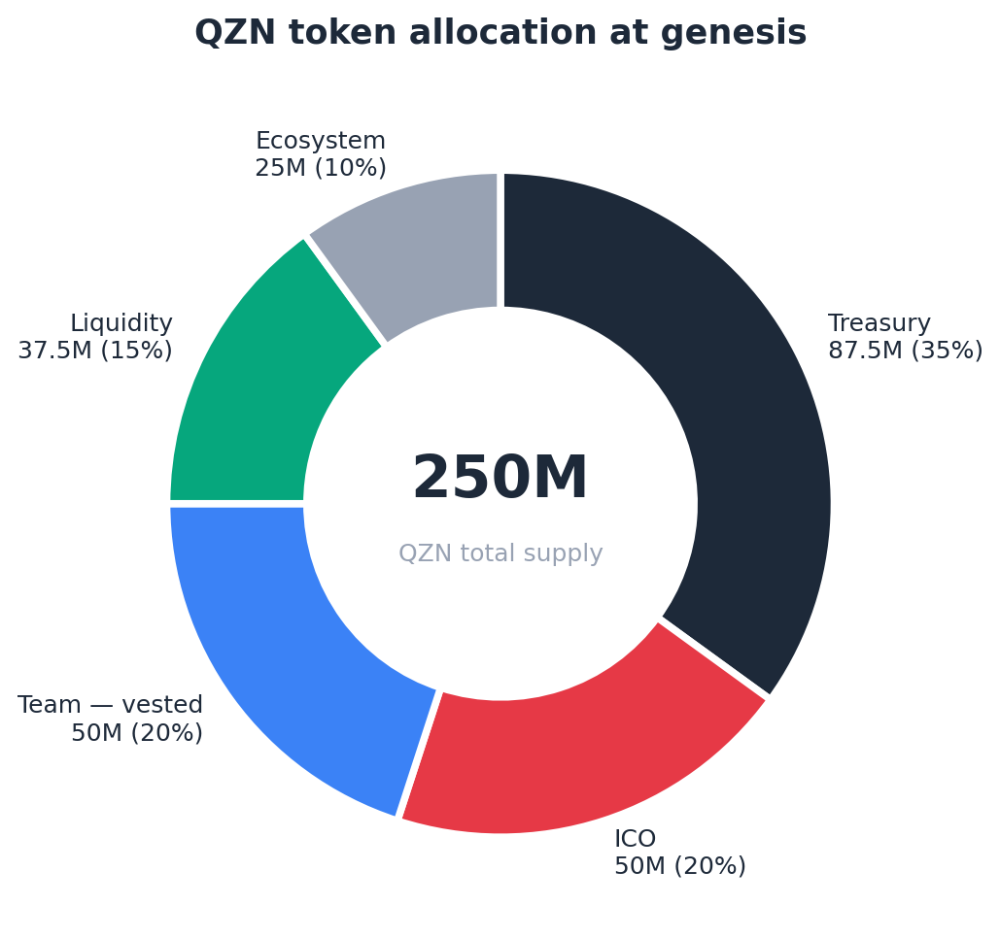

# QZN Protocol — Incubation Proposal v2

**Hunter Dutt · Qubzylthar Nexus LLC · April 2026**

---

## TL;DR

Asking for **10B QU** to finish the QZN audit. We pay it back, in full, within 24 months. Founder + ICO covers the other half. The project is built, tested, and ready — this is finishing capital, not building capital.

---

## What's built

Six smart contracts. **10,172 lines** of C++. **436 of 436 tests passing.** Three live games on Qubic.

| | |
|---|---|
| Token_v2 | Routing hub. Every QZN transfer flows through it. |
| GameCabinet | Player wagers, dual-signature settlement (server + player). |
| RewardRouter | Prize distribution, staking rewards, leaderboard. |
| Treasury Vault | 8-signer multi-sig, governance proposals. |
| Tournament Engine | Bracket play, prize pools. |
| NOVUM INITIUM | NOVUM INITIUM node ownership, access tiers. |

Live at **qzn.app** · Backend at **api.qzn.app** · Repo: github.com/dutt9145/qzn-core-lite

---

## What changed from v1

The board flagged three things in v1. v2 fixes all three.

| v1 issue | v2 fix |
|---|---|
| Genesis burn was confusing | **No burn.** The 12.5M QZN that would have burned is now in Treasury under multi-sig governance. |
| Unit economics weren't defensible | **Routing is in the contract.** Every match splits prize / staker / treasury / liquidity / node / burn by hardcoded percentages. Numbers live in code, not slides. |
| Funding picture was vague | **Funding is fully stacked.** 10B board + 10B founder/ICO. No gaps, no IOUs. |

**Ask shrunk 67%** (30B → 10B). Listening to the board was the whole point.

---

## How the audit gets funded

Mundus quoted **25B**. We negotiated to **20B**. Savings passed straight through to a smaller board ask.

| Source | Amount |
|---|---|
| Incubation Board | 10B QU |
| ICO proceeds + founder personal | 10B QU (deployed as needed) |
| Qubic free audit slot | 1 contract (Token_v2) |
| **Total funded** | **20B QU** |

**No upfront lump-sum.** Mundus gets paid by milestone. We don't trust audit money to anyone before they deliver — that's how scams happen.

---

## Token allocation

**250M QZN total.** Team allocation locked behind a 1-year cliff and 5-year linear vest — coded into Token_v2, not changeable post-deployment.

---

## ICO plan

Issuance through **QubicTrade**, listing through **QIP**. Native rails, no bridges, no custom infrastructure.

| Phase | Tokens | Price | Raise |
|---|---|---|---|
| Phase 1 | 12.5M QZN | 250 QU | 3.125B QU |
| Phase 2 | 37.5M QZN | 450 QU | 16.875B QU |
| **Total** | **50M QZN** | | **~20B QU** |

3.5B already reserved separately for QubicTrade + QIP fees. Not part of this ask.

---

## How we pay the board back

**100% repayment over 24 months.** No interest. Funded from post-ICO protocol revenue (node sales, game fees, fee routing).

- Right to prepay early — no penalty
- Quarterly written reports
- Public on-chain reporting via Qubic tickchain
- Founder personally backstops if revenue runs slow

If the project succeeds faster, the board gets paid back faster. If it doesn't, the founder absorbs the timeline — never a default.

---

## Why this works

**For the board:**
- 67% smaller ask than v1
- 50/50 split with founder/ICO — never carrying it alone
- Milestone disbursement — no money before delivery
- Full repayment with prepay option

**For Qubic:**
- First arcade gaming layer, audited and ready
- Template for future incubation proposals — structured, accountable, repayable
- Capital recycles back to the Ecosystem Fund within two years

**For QZN:**
- Audit completes in time for June ICO
- Token_v2 (the routing hub) gets professional eyes via Qubic's free audit slot
- GameCabinet + RewardRouter (the two largest user-facing contracts) get private audit
- Project enters ICO with audited core contracts

---

## What happens if the board approves

| Day | Action |
|---|---|
| 0 | Board approval received |
| 7 | Mundus SOW signed |
| 14 | Audit Phase 1 kicks off |
| 30–60 | Audit deliverables published |
| Pre-ICO | Final report public, ICO ready |
| 90 | First quarterly report to board |

---

## Legal posture

Qubzylthar Nexus LLC (Wyoming) · EIN on file · NAICS 511210 · Mercury banking · SAM.gov in progress.

All flows route through the LLC. Repayment auditable on both sides.

---

## Contact

**Hunter Dutt** · `@Dutte` on Discord

<<<<<<< HEAD
### Stage 1: Community Engagement (Weeks 1–2)

- Public announcement of incubation approval with full protocol overview
- AMA session in the Qubic Discord with QZN founder and ecosystem advisors (DeFiMomma, JoeTom)
- ICO whitelist campaign launch — early registrations collected via [hello@qzn.app](mailto:hello@qzn.app)
- Technical explainer thread on contract architecture, BPS routing, and flywheel mechanics
- Discord bot ICO hype campaigns activated (ICO_LIVE flag toggled to true)

### Stage 2: Core-Tech PR Review (Weeks 2–7)

| Week | Contract | Index | Primary Review Focus |
|---|---|---|---|
| W2 | QZN_Token_v2 | 26 | Supply integrity, burn endpoint, cross-contract call safety |
| W3 | QZN_GameCabinet_PAO | 27 | Entry fee handling, game registry access controls |
| W4 | QZN_RewardRouter_PAO | 28 | BPS arithmetic precision, reentrancy, atomic routing |
| W5 | QZN_TreasuryVault_PAO | 29 | Treasury access controls, spending policy enforcement, emergency pause |
| W6 | QZN_Portal_PAO | 30 | Node staking, slashing conditions, reward distribution |
| W7 | QZN_TournamentEngine_PAO | 31 | Bracket logic, epoch management, prize escalation integrity |

Each PR includes: contract source, inline documentation, the corresponding GTest suite, and a plain-language summary for non-specialist reviewers. JoeTom has confirmed the single-proposal, six-contract approach and is aware of the PR sequence.

### Stage 3: Formal Security Audit (Months 2–3)

Upon core-tech approval of all six PRs, the 25B QU audit allocation is released to mundus_tj85. A formal written quote of 25B QU has been received. The audit scope covers all six contracts with particular emphasis on cross-contract call chains, BPS arithmetic overflow/underflow, PAO governance attack surfaces, and treasury access control bypass vectors. Estimated audit duration: 6–8 weeks. All findings will be remediated and re-submitted for auditor sign-off prior to deployment. No contract will be deployed to mainnet without full auditor sign-off.

### Stage 4: Mainnet Deployment & ICO Launch (Month 4)

1. ICO Phase 1 opens (12.5M QZN at 150 QU, whitelist-gated 72 hours, then public)
2. QSWAP listing at Phase 2 reference price of 337 QU/QZN
3. qzn.app goes fully live with all game pages, staking dashboard, ICO NOVUM INITIUM, and NOVUM INITIUM node registration
4. TournamentEngine inaugural tournament launches — first prize pool funded by treasury as community incentive

### Full Timeline

| Month | Phase | Key Milestones |
|---|---|---|
| Apr 2026 | Community Engagement | Incubation announcement, AMA, whitelist campaign, ICO bot activation |
| Apr–May 2026 | Core-Tech PR Review | 6 PRs submitted weekly; community feedback incorporated |
| May–Jun 2026 | Formal Audit | mundus_tj85 audit; bug remediation; re-sign-off |
| Jul 2026 | Mainnet + ICO | Deploy contracts; ICO Phase 1 open; QSWAP listing; site live |
| Aug 2026 | ICO Phase 2 | Phase 2 opens at 337 QU; TournamentEngine inaugural event |
| Sep 2026 | Growth | NOVUM INITIUM node onboarding; game developer outreach; staking rewards begin |
| Q4 2026 | Scale | Additional game integrations; first quarterly ecosystem contribution (Month 6); roadmap v2 published |

---

## 9. Governance & Treasury Controls

### Current Structure: Founder-Custodied Treasury with Published Spending Policy

The QZN treasury is initially held under founder custody as a **temporary launch-phase structure**, designed to ensure execution speed and eliminate early-stage coordination risk. This structure is accompanied by strict, publicly defined spending constraints and full on-chain transparency.

QZN is committed to transitioning to a **multi-signature governance model (2-of-3 minimum)** prior to the completion of ICO Phase 2. This transition is not conditional — it is a required milestone in the protocol's governance evolution.

### Published Spending Policy — Hard Caps

All treasury fund movements are subject to the following hard caps, published publicly and binding on the founder:

| Category | Hard Cap | Notes |
|---|---|---|
| Security audit disbursement | 25,000,000,000 QU | Released directly to mundus_tj85 upon core-tech PR approval. Single transaction. No discretionary use. Funded from incubation grant, not ICO proceeds. |
| Community & marketing (ops buffer) | 2,000,000,000 QU | Discord campaigns, bounties, AMAs, community onboarding through mainnet launch. Funded from incubation grant ops buffer. |
| **Ecosystem Fund Donation** | **5% of gross ICO proceeds (936,250,000 QU)** | **Paid directly to Qubic ecosystem development fund within 60 days of ICO Phase 2 close. Off the top. Non-discretionary.** |
| Liquidity seeding (QSWAP) | 40% of net ICO proceeds (7,115,500,000 QU) | Deployed directly to QSWAP at listing. Not subject to discretionary reallocation. |
| Development reserve | 27% of net ICO proceeds (4,803,000,000 QU) | Smart contract development, frontend infrastructure, tooling |
| Operational runway | 10% of net ICO proceeds (1,778,875,000 QU) | Server costs, tooling, legal (Wyoming LLC formation) |
| Marketing & growth | 23% of net ICO proceeds (4,091,412,500 QU) | Ecosystem partnerships, community growth, external developer outreach |
| Founder withdrawals | $0 until ICO Phase 2 close | Founder takes no compensation from treasury prior to full ICO completion |

**ICO proceeds allocation totals 100% of net proceeds.** The ecosystem donation is taken from gross proceeds before allocation. Unspent operational buffer from the incubation grant ops allocation is returned to the Incubation Program, not absorbed into treasury.

### On-Chain Transparency Commitment

Every treasury transaction above 100,000,000 QU will be announced publicly in the QZN Discord and documented in a running public ledger at a pinned channel prior to execution. This creates a community-visible paper trail for every material fund movement, approximating the accountability function of a multi-sig without requiring a trusted co-signer.

### Multi-Sig Upgrade Path

QZN is committed to upgrading to a 2-of-3 multi-signature governance structure prior to ICO Phase 2 close, once ecosystem relationships of sufficient depth and trust have been established. The Community Elect keyholder position will be filled by a community governance vote conducted publicly in the QZN Discord. The Incubation Board will be notified publicly when the upgrade is complete. This is not a deferral of accountability — it is an honest sequencing of trust. QZN will not appoint keyholders it cannot vouch for simply to check a box.

---

## 10. Risk Factors & Mitigations

| Risk | Severity | Mitigation |
|---|---|---|
| Smart contract vulnerability | High | Formal audit by mundus_tj85; 436/436 GTest suite; sequential core-tech PR review one contract per week prior to audit; post-audit remediation gate before deployment |
| Low initial user adoption | Medium | ICO pre-commitment creates day-1 financial alignment; autonomous Discord bot and campaigns de-risk cold-start; 3 live games reduce time-to-value to zero |
| QU price volatility | Medium | Operating costs USD-denominated ($5,176/yr fixed); treasury held in QU; no USD-pegged obligations; ICO proceeds provide 3.6 years runway at zero revenue |
| Regulatory / gaming compliance | Low | Skill-based mechanics only; no RNG-based outcomes; CLARITY Act utility token classification; Wyoming LLC formation pre-ICO |
| Founder single point of failure | Medium | Sole-custody treasury with published hard-cap spending policy and public transaction ledger; fully open-source contracts; Pham (pctsvn) as independent frontend contributor; multi-sig upgrade committed prior to ICO Phase 2 close |
| Core-tech PR delays | Low | JoeTom coordination confirmed; sequential one-per-week PR strategy avoids reviewer bottleneck; 8-week buffer built into roadmap before audit begins |

---

## 11. Team & Credentials

### Hunter Duttenhefer (H-BOMB) — Founder & Lead Smart Contract Developer

Hunter Duttenhefer is a credentialed Qubic Ambassador, ASCP-certified Medical Laboratory Scientist, and MBA-educated financial analyst who represents one of the most technically diverse founder profiles in the Qubic ecosystem. He brings together three disciplines that rarely coexist in a single builder: clinical precision, financial rigor, and full-stack blockchain engineering.

He built the entire QZN smart contract suite — 10,172 lines of production C++ across six contracts — entirely solo, while simultaneously maintaining an active clinical career. This is not a team that assembled around an idea. This is a single engineer who identified a gap in the Qubic ecosystem, architected a solution from first principles, and built it to production-grade quality before seeking institutional support.

His technical depth is broad and verifiable: Qubic QPI/C++ smart contract development, Next.js/TypeScript frontend engineering, Railway/Supabase infrastructure deployment, SQL/Power BI/Clarity analytics, and algorithmic trading system design. His MBA in Finance underpins the economic architecture of the QZN flywheel — the BPS routing structure, ICO pricing strategy, tokenomics model, and treasury governance framework are not outsourced deliverables. They are the work of a founder who understands both the code and the capital markets it is designed to serve.

### Pham (pctsvn) — Core Frontend Developer

Pham is a core member of the QZN development team responsible for the frontend architecture and mobile responsiveness of qzn.app. Working across the Next.js/TypeScript/Tailwind stack, Pham holds Developer access to the QZN Vercel deployment and manages pull request approvals on the primary frontend repository under a structured branch protection workflow (`feature/*` → `dev` → `main`). His contributions span the full frontend surface of the protocol — game pages, staking dashboard, ICO NOVUM INITIUM, leaderboard, rewards, epochs, whitepaper, NOVUM INITIUM node registration, and the QSWAP integration page. Pham represents the protocol's second independent technical contributor, ensuring that QZN's frontend development and deployment capability is not a single point of failure.

### Ecosystem Advisors

| Name | Role | Contribution to QZN |
|---|---|---|
| JoeTom | Qubic core developer | Confirmed single-proposal six-contract PR approach; coordinating mainnet deployment at indices 26–31; technical sounding board on contract architecture |
| mundus_tj85 | Appointed auditor | 25,000,000,000 QU formal written quote received; full six-contract audit scope confirmed |
| DeFiMomma | Ecosystem connector | Introduced QZN to the incubation program; community credibility anchor; ongoing ecosystem ambassador |
| E | Ecosystem developer | Informal technical advisory; cross-protocol development coordination |

---

## 12. Closing Statement

QZN Protocol is not a concept. It is not a whitepaper. It is not a team with an idea and a pitch deck. It is a fully built, test-verified, audit-ready system — six production smart contracts totaling 10,172 lines of C++, a live and playable frontend, a deployed autonomous marketing engine, and a 250,000,000-token economic architecture with 99.8% gross margins, a Rule of 40 score of 855, and a self-reinforcing flywheel that mechanically improves with every single game session.

The Qubic Incubation Program's 30,000,000,000 QU grant does not fund a vision. It funds a security audit. The vision is already built. The code is already written. The tests are already passing. The community is already active. The frontend is already live. The audit is the final gate between QZN and mainnet — and the Incubation Program holds the key.

In return, the Qubic ecosystem receives something no incubated project has delivered before: a structured, multi-mechanism return that begins before the first game is ever played. Upon ICO Phase 2 close, 936,250,000 QU flows directly to the Qubic ecosystem development fund — a concrete return on the board's investment that is independent of protocol performance and paid before any other treasury allocation. From there, the compounding begins: 7,115,500,000 QU seeded into QSWAP liquidity at mainnet launch, 36,432,000 QU permanently removed from circulation over three years through session burns alone, and quarterly ecosystem contributions at 10% of total protocol revenue starting Month 6 — reaching 453,600 QU per year at Year 3 run rate and growing with every new user, every new game, and every tournament epoch. QZN does not succeed unless Qubic succeeds. The incentives are not aligned by coincidence. They are aligned by design.

QZN is not attempting to discover product-market fit post-funding. It has already built the system, validated the mechanics, and defined the economic model. The incubation grant does not fund experimentation — it unlocks deployment.

**QZN is ready. The board's approval sets the clock.**

---

**Hunter Duttenhefer · Founder, QZN Protocol**
[hello@qzn.app](mailto:hello@qzn.app) · [github.com/dutt9145/qzn-core-lite](https://github.com/dutt9145/qzn-core-lite) · [qzn.app](https://qzn.app)
=======
Thank you to the board, and to Mr. Rose specifically, for the v1 feedback. This proposal exists because that feedback was clear and actionable.
>>>>>>> d9b3c7d (Add v2 incubation proposal with charts)
